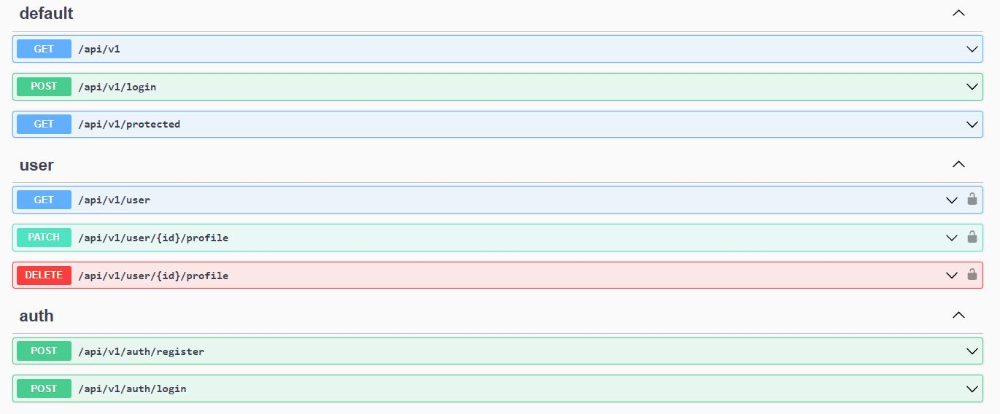
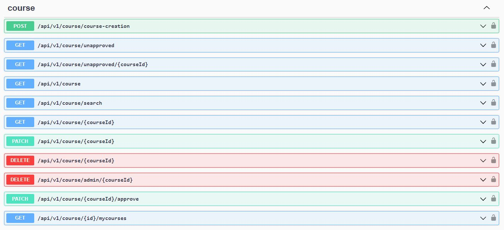
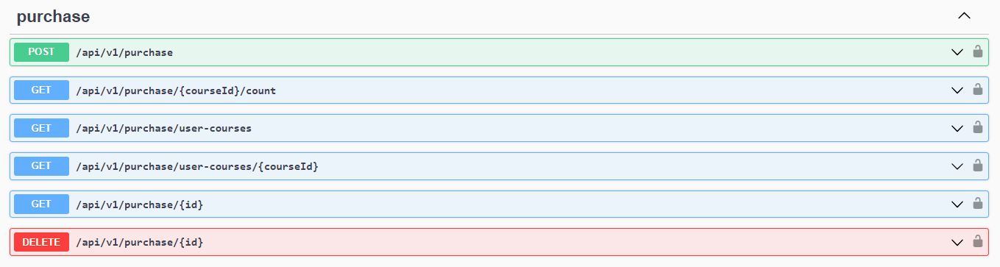

<h2>Table of Contents</h2>

* [Project Description](#descripcion-del-proyecto)
* [Key Features](#key-features)
* [Swagger](#swagger)
* [Logical Data Model](#ddbb-model)
* [Technologies](#tecnologias)
* [Project Developers](#autores)
* [Links to Resources](#links)
---

<h2 align="center" class="descripcion-del-proyecto">Project Description</h2>

U-Know is the new collaborative learning platform. Our goal is to create a community for learning and sharing knowledge. To access our community, you will need to register with your name, email, password, and create a unique username. Upon accessing your new account, you will receive 1000 knowlitos, which are the coins you can use to acquire the published courses. You can also publish your own modules on our platform and earn knowlitos, allowing you to continue learning.  

<h2 align="center" class="key-features">Key Features</h2>

### <b>User Registration:</b>
* Can view the list of contents sorted by rating.
* Can search for contents by keywords in the description.
* Can register for an account.

### <b>Registered User:</b>
* Can log in to their account.
* Can view the list of contents.
* Can search for contents by keywords.
* Can update their profile (except for name, email, and wallet).
* Can create content.
* Can edit their own content.
* Can delete their own content if it has not been purchased.
* Can view the list of their created content.
* Can purchase content.
* Can view the list of purchased content.
* Can view a purchased content.
* Can rate a purchased content (only once).
* Can comment on a purchased content (only once).

### <b>Administrator:</b>
* Can view the list of contents.
* Can search for contents by keywords.
* Can delete content.
* Can view the list of users.
* Can delete a user.
* Can update a user's information.

### <b>System:</b>
* Updates the user's wallet upon registration.
* Updates the user's wallet upon purchasing content.
* Updates the price of content upon publishing.
* Notifies the user if their wallet balance is insufficient to purchase content.
* Adjusts the course rating with each user rating.
* The first four ratings will only count if they are >= 4.8.
* From the 5th rating onwards, the average rating is calculated.
* Communicates the course rating in real-time.
* Updates the price of content when the average rating falls below or equal to 3.
* Can update a user's information.

<h2 align="center" class="swagger">Swagger</h2>

<h2 align="center" class="ddbb-model">Logical Data Model</h2>

<h2 align="center" class="tecnologias">Tools and Technologies</h2>

* <b>NestJS:</b> A framework for building efficient and scalable server-side applications with Node.js.
* <b>Node.js:</b> A JavaScript runtime environment used for server-side development.
* <b>MySQL:</b> Relational database management system used for storing and managing data.
* <b>Visual Studio Code:</b> Integrated development environment (IDE) used for coding.
* <b>GitHub:</b> Version control system for managing and sharing code repositories.
* <b>Trello:</b> Project management tool for organizing tasks and workflows.
* <b>Discord:</b> Communication platform for team collaboration and discussions.
* <b>WhatsApp:</b> Instant messaging application for team communication and coordination.
* <b>Slack:</b> Team communication and collaboration platform.

<h2 align="center" class="autores">Project Developers</h2>

* Ana Pozo
* Deniz Ozedorgan
* Diego Cruz
* Roxana Raduta
* Renata Yumi

<h2 align="center" class="links">Links to Resources</h2>

* Presentation:
* Trello: https://trello.com/invite/b/1ayGpBfw/ATTIe5b8416899e11aff79a3daf3e129aa3d258160DD/u-know-api
* Swagger: http://localhost:3000/docs

---

  
  

